# How to use TCQ

## Overview

[TCQ](https://github.com/bterlson/tcq) is an app made by @bterlson to create a queuing system for speaking during ECMA TC39 (ECMAScript) meetings.  The app's features are generally useful for any meeting. It especially benefits those meetings that entail interactive discussion and/or have remote participants.

A managed instance runs at https://tcq.app/ .  You login via OAuth using your Github account.

## For meeting participants

Join a meeting by clicking a meeting link (ex: https://tcq.app/meeting/kouy) or entering the 4-character meeting code in the [app's homepage](https://tcq.app/).

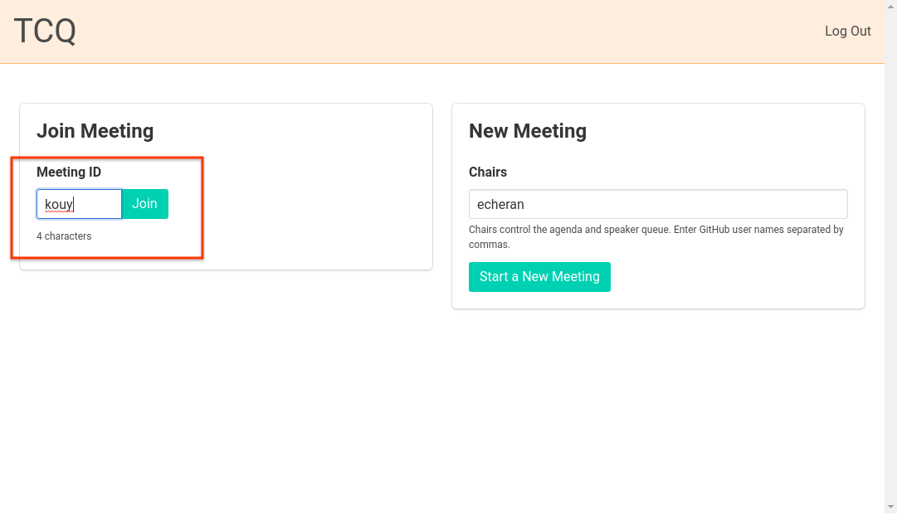

### Agenda view

When joining a meeting, you initially see the Agenda view.  Click the "Queue" button to enter the Queue view.

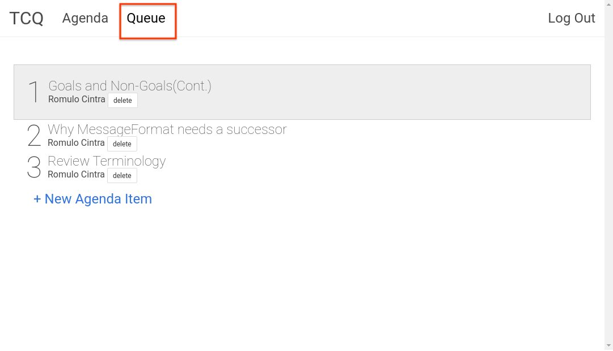

### Queue view

The queue view is the main view for participants and hosting participants alike. The following screenshots will explain the 4 ways to enter a talking point into the queue:

* New Topic
* Reply ("Discuss") Current Topic
* Clarifying Question
* Point of Order

The queue view lists the active topic and who is currently speaking.  Only the currently speaking person is allowed to speak.  The topic owner is allowed to respond without being prompted. Otherwise, the currently speaking person must specifically prompt someone before they can speak in response.

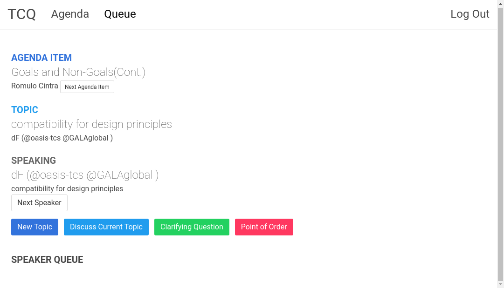

### Reply to (Discuss) current topic

For those who are not speaking and want to reply to the discussion of the ongoing topic, they can reply by clicking the Discuss Current Topic button.

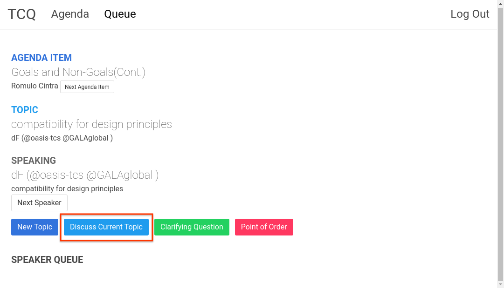

After clicking the button, enter a short title for the reply.

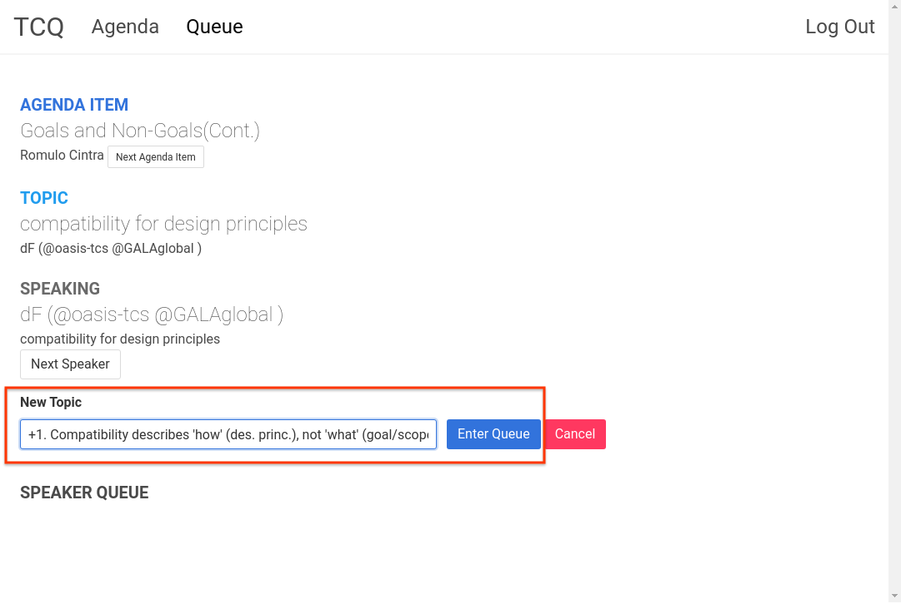

### New topic

The "New Topic" button creates a new topic altogether. New topics enter the queue at the end.

Note: New replies to the *current topic* enter the queue *before* any new topics.  All replies to the current topic are still kept in order.

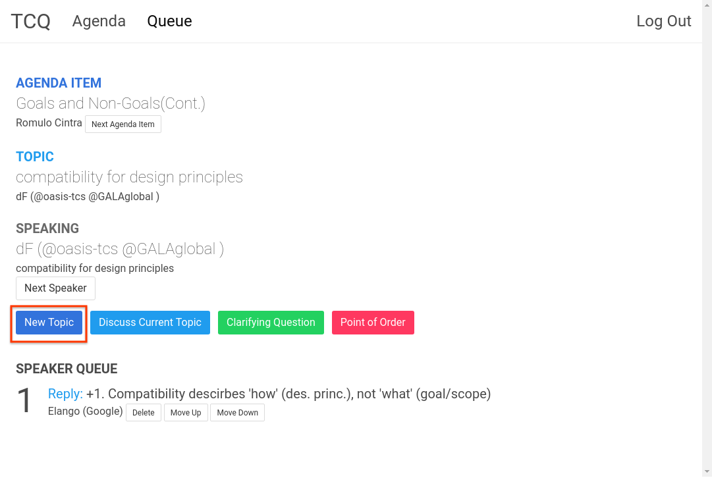

After clicking the button, enter a short title for the new topic.

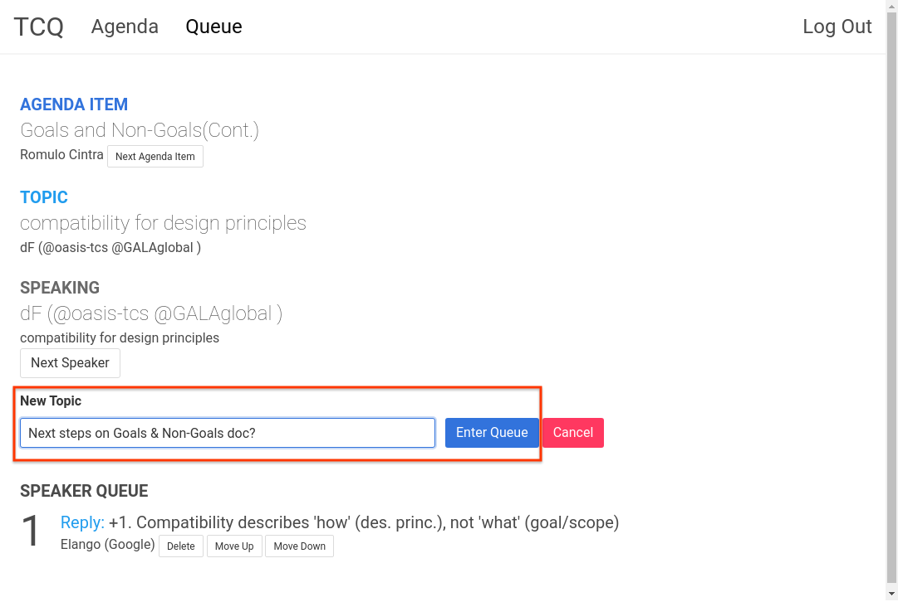

### Clarifying question

The "Clarifying Question" button is used to ask a question necessary for understanding the current topic at hand.

Note: Clarifying questions enter the queue *before* replies to the current topic (and any new topics). The reason is that clarifying the context or terms of the discussion now affects any future replies to the current discussion.

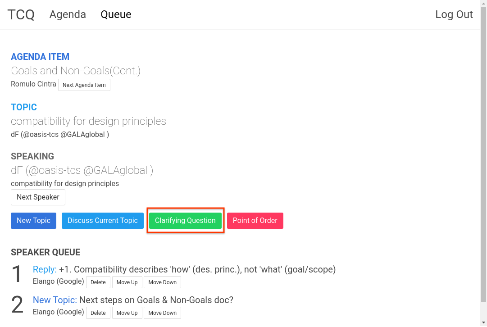

After clicking the button, enter a short title for the reply.

### Point of order

The "Point of Order" button is used to address a "meta-concern" for the meeting that is not related to the specific content of the discussion.  It could relate to logistics, flow or process, such as how to mange remaining time, the current speaker not audible, topic is redundant, etc.

Note: Points of order enter the queue *before* all other types (clarifying questions, replies to current topic, new topics).  These concerns are expected to be more rare than all others, but they can address issues that are important to the meeting overall.

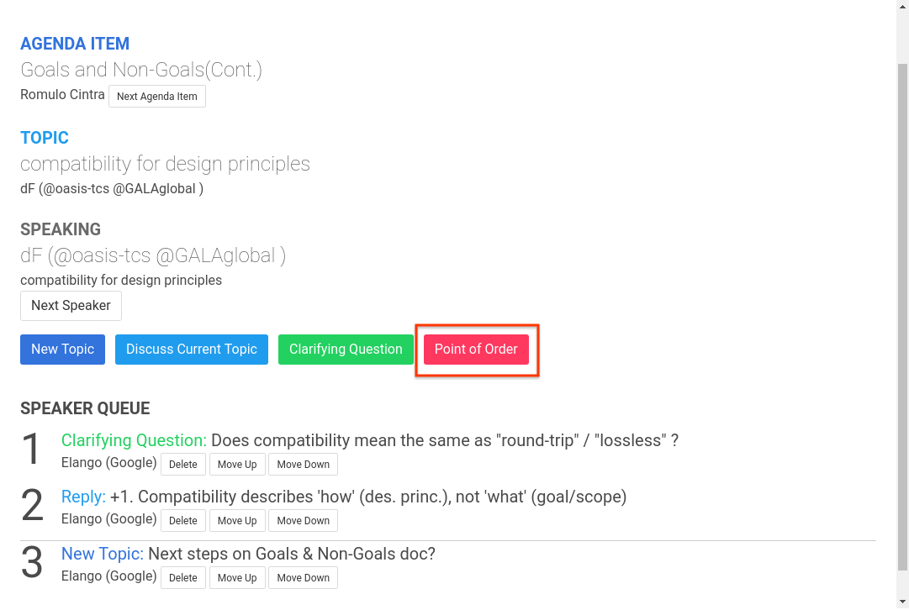

After clicking the button, enter a short title for the point of order.

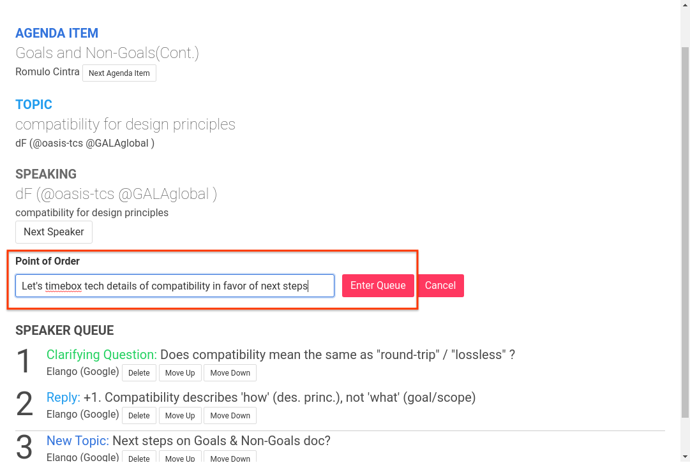

### Queue view showing all item types

Here is the queue view again with all speaking point types represented.

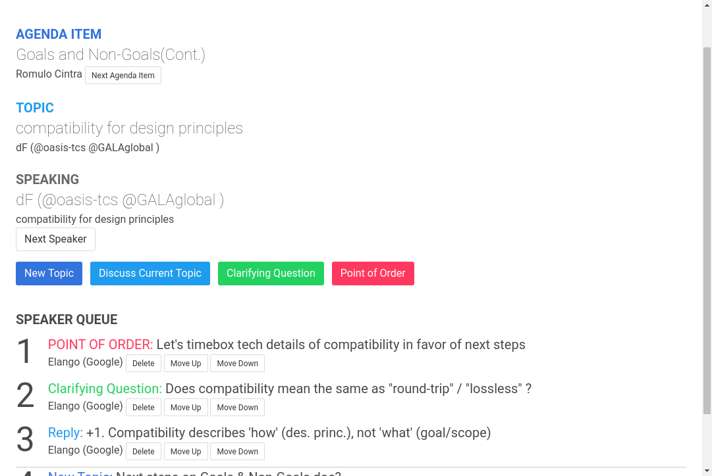

## For meeting hosts

For participants who are hosting the meeting (the meeting creator can grant host access to other moderators), there are a few extra buttons that are not visible to the others.

The most important button is "Next Speaker".  Once a talking point is done (point of order, clarifying question, reply, new topic point), use this button to advance to the next speaker in the queue.

Occasionally, talking points can get out of order.  Ex: a reply to a topic that is already over, or a glitch causing duplicate topics.  You can use the "Delete", "Move Up", and "Move Down" buttons to rearrange accordingly.

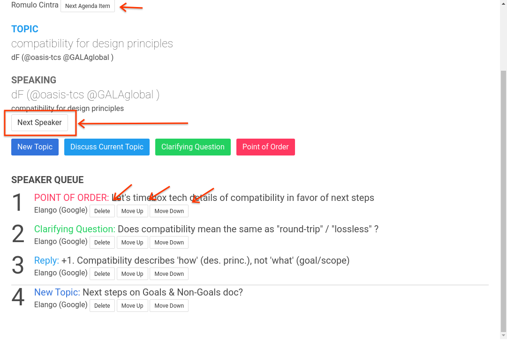
