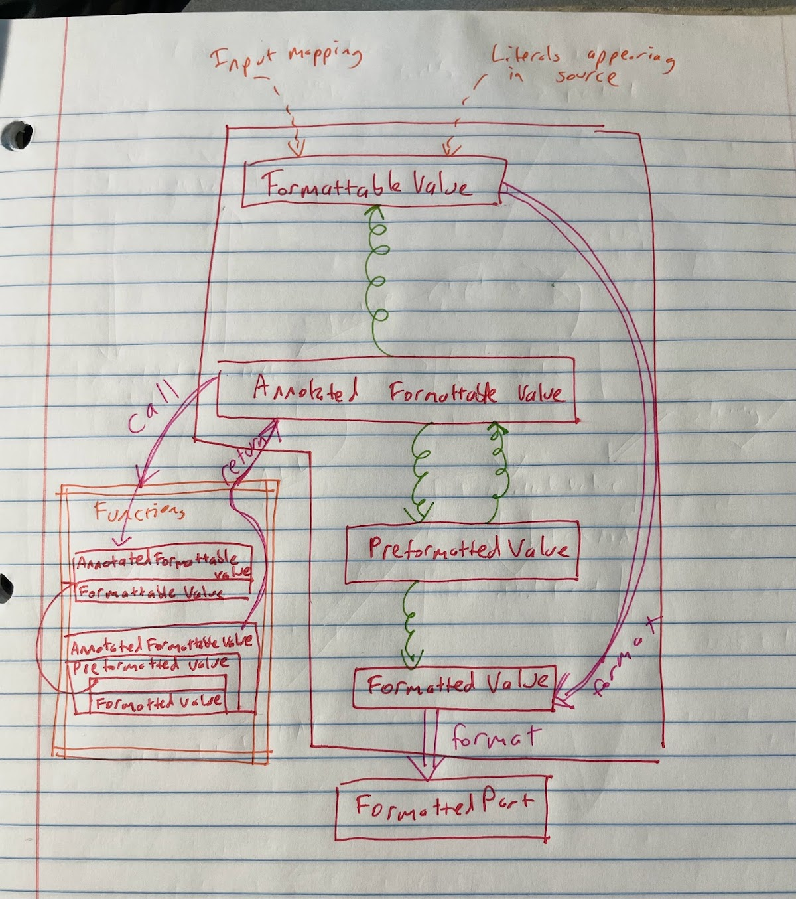
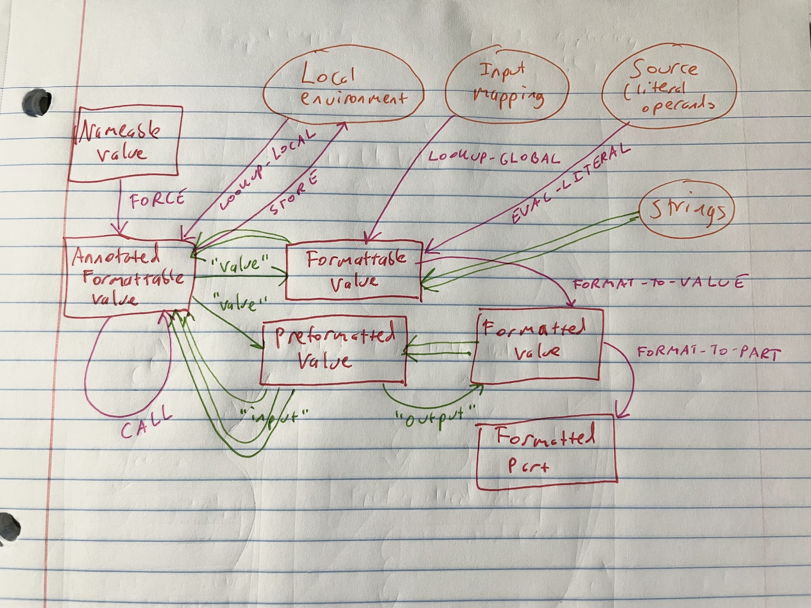

# Data Flow for Composable Functions

Status: **Proposed**

<details>
	<summary>Metadata</summary>
	<dl>
        <dt>Contributors</dt>
        <dd>@catamorphism</dd>
        <dd>@stasm</dd>
        <dt>First proposed</dt>
        <dd>2024-02-13</dd>
        <dt>Pull Request</dt>
        <dd><a href="https://github.com/unicode-org/message-format-wg/pull/645">#645</a></dd>
	</dl>
</details>

## Objective

Custom formatting functions should be able to
inspect the raw value and formatting options
of their arguments.
In addition, while a custom formatter may eagerly
format its operand to a string,
returning the raw underlying value
and the formatting options used for formatting
are also useful,
in case another function wants to extend these options
or use them for other logic.

Making the underlying structure of its inputs,
as well as requiring formatters to return structured outputs,
makes it possible to specify how different functions
can be _composed_ together
(as shown in example 1.1 before)

## Background

In the accepted version of the spec (as of this writing),
the term "resolved value" is used for several different kinds
of intermediate values,
and the structure of resolved values is left completely
implementation-specific.

Providing a mechanism for custom formatters to inspect more
detailed information about their arguments requires the
different kinds of intermediate values to be differentiated
from each other and more precisely specified.

At the same time, the implementation can still be given freedom
to define the underlying types for representing formattable values
and formatted results. This proposal just defines wrappers
for those types that implementations must use in order to
make custom functions as flexible as possible.

## Use-Cases

Use cases from [issue 515](https://github.com/unicode-org/message-format-wg/issues/515):

The following code fragment
invokes the `:number` formatter on the literal `1`,
binds the result to `$a`, and then invokes `:number` on the
value bound to `$a`.

If the value of `$a` does not allow for inspecting the previous options
passed to the first call to `:number`,
then the `$b` would format as `1.000`.

### Example 1.1
```
.local $a = {1 :number minIntegerDigits=3} // formats as 001.
.local $b = {$a :number minFractionDigits=3} // formats as 001.000
// min integer digits are preserved from the previous call.
```

In other words: the user likely expects this code to be equivalent to:

### Example 1.2
```
.local $b = {1 :number minIntegerDigits=3 minFractionDigits=3}
```

But without `:number` being able to access the previously passed options,
the two fragments won't be equivalent.
This requires `:number` to return a value that encodes
the options that were passed in, the value that was passed in,
and the formatted result;
not just the formatted result.

This example is an instance of the basic motivator for this proposal:
allowing data that flows out of a function call
to flow back into another function call
with all of its metadata (e.g. options) preserved.

### Example 1.3
```
.input {$item :noun case=accusative count=1}
.local $colorMatchingGrammaticalNumberGenderCase = {$color :adjective accord=$item}
```

The `:adjective` function is a hypothetical custom formatter.
If the value of its `accord` option is a string, it's hard for `:adjective`
to use the value of `accord` to inflect the value of `$color` appropriately
given the value of `$item`.
We want to pass not the formatted result of `{$item :noun case=accusative count=1}`
into `:adjective`, but rather, a structure that encodes that formatted result,
along with the resolved value of `$item` and the names and values of the options
previously passed to `:noun`: `case` and `count`.

### Example 1.4

```
.local $foo = {$arg :func}
```

Here, `$arg` is treated as an input variable.
Suppose that internally, an implementation wants to pre-define
some formatting options on all input variables
(or all input variables whose values have a particular type).
It would be helpful if functions could accept
a single argument that wraps the value of `$arg`
along with these predefined options,
separate from the options that are specific to the function.

## Requirements

- Define the structure passed in as an argument to a custom formatting function.
- Define the structure that a custom formatting function should return.
- Maintain the options passed into the callee as a _separate_ argument to the
  formatter, to avoid confusion. (See Example 4 below.)
- The structure returned as a value must encode the formatted result,
input value, and options that were passed in.
- Articulate the difference between a "formattable value"
(which is the range of the input mapping (argument mapping),
and the result of evaluating a _literal_)
and a "formatted value"
(which is what a formatting function (usually) returns).
- Clarify the handling of formattable vs. formatted values:
does a formatting function take either, or both?
  - This proposal proposes that formatter _inputs_ are a superset of
  formatter _outputs_ (in other words, the output of a formatter can
  be passed back in to another formatter).

Any solution should support the examples shown in the "Examples" section.
Minimally, any solution should identify a set of concepts
sufficient for the spec to articulate
that function return values must include a representation of
their input and options,
and not just a "fully formatted" string, other value, or sequence of values.

## Constraints

### Implementation-defined behavior

According to
[the "Introduction" section of the spec](https://github.com/unicode-org/message-format-wg/blob/main/spec/formatting.md#introduction)
> "The form of the resolved value is implementation defined"

In this proposal, we want to maintain all the
flexibility that implementations require,
as promised by the existing spec,
while also describing more precisely
what an expression "resolves to".

### Requirements for being formattable

The same paragraph of the spec describes the form of the resolved value as follows:

> "...it needs to be "formattable", i.e. it contains everything required by the eventual formatting."

The purpose of this proposal is to define
what "everything required by the eventual formatting" means,
reconciling the promise of an implementation-defined "resolved value"
with the requirement that implementations preserve
enough metadata when binding names to values
(either directly in a _declaration_
or indirectly in a function call).

### Evaluation order

The spec does not require either eager or lazy evaluation.

Typically, a lazy implementation has an internal
"thunk" type representing a delayed computation.

That presents no problems for this proposal,
since we distinguish a _nameable value_ type
(which may appear in the formatter's local environment,
but _not_ as a runtime argument to a function)
that may be distinct from any of the other value types.

### The function registry

Function registry contains specifications of the correct "input",
but that's distinct from what we're saying is the "input".
Need the right terminology:
* `:number` takes a string or number (for example),
but that's always wrapped in a (?) `FormattedPlaceholder` thing
that also has fields representing the options from the previous
formatter.

- See the "Function Resolution" section of the spec

Step 4: "Call the function implementation with the following arguments..."
* "If the expression includes an operand, its resolved value.

If the form of the resolved value is implementation-defined,
it's hard to say what the form of the input to the formatting function is,
and likewise its result.

https://github.com/unicode-org/message-format-wg/blob/main/spec/formatting.md#function-resolution

### Internal representations

The interfaces presented in this proposal should
be taken as guidance to implementations
for how to provide the minimum functionality
for composable functions
(how to preserve options through chains of formatters).
The in-memory representation of each type
depends on the programming language
and other implementation choices.
As with the [data model spec](https://github.com/unicode-org/message-format-wg/blob/main/spec/data-model/README.md),
an example model for dataflow is presented here
using TypeScript notation.

## Proposed Design

### Taxonomy


This proposal introduces several new concepts
and eliminates the term "resolved value" from the spec.

* _Nameable value_: A value that a variable can be bound to
in the runtime environment that defines local variables.
This concept is introduced to make it easier for the spec
to formally account for both eager and lazy evaluation.
In an eager implementation, "nameable value" is synonymous
with "annotated formattable value",
while in a lazy evaluation, a "nameable value" would be a
closure (code paired with in-scope set of variables).

> [!IMPORTANT]
>
> In the rest of this proposal, we elide the distinction
> between a _nameable value_ and
> an _annotated formattable value_,
> as the semantics of MessageFormat can be
> implemented either eagerly or lazily
> with the same observable results
> (other than possible differences in the set of errors).
> Examples assume eager evaluation.
> In a lazy implementation, _nameable values_ would
> be constructed when processing a _declaration_,
> and these values would be _forced_ when
> formatting a _pattern_ requires it.

* _Formattable value_: An implementation-specific type
that is the range of the input mapping (message arguments),
as well as what literals format to.

* _Formatted value_: The result of a formatting function.
This type is implementation-specific, but expected to
at least include strings.

* _Formatted part_: The ultimate result of formatting
a part of a pattern (_text_ or _expression_).
In an implementation that offers "formatting to parts"
(as in [the Formatted Parts proposal](./formatted-parts.md)),
the _formatted part_ type might be the same as the
_formatted value_ type, or it might be different.
(In the latter case, the implementation might apply an
implementation-specific transformation
that maps a _formatted value_ onto a _formatted part_
in a particular _formatting context_.)

* _Fallback value_: A value representing a formatting error.
  * For simplicity, this proposal elides the details of
    error handling and thus this type is
    not discussed further.

* _Annotated formattable value_: Encapsulates any
value that can be passed as an argument to a formatting function,
including:
  * formattable values that don't yet have formatted output
    associated with them
  * previously formatted values, which can be reformatted by
    another formatting function
  * fallback values
The values of named options passed to formatting functions
are also _annotated formattable values_.

> NOTE: Names are subject to change; an _annotated formattable value_
> could also be called an _operand value_,
> since it has the capability of being passed into a function.

* _Markup value_: The result of formatting a markup item
(disjoint from _annotated formattable values_).
  * For simplicity, we elide the details of markup values
    from this proposal.

* _Preformatted value_: A formattable value paired with a
formatted value (and some extra information).

> NOTE: A _preformatted value_ could also be called an _annotated value_
> (see Example 1.4)

In the current spec, a "resolved value" can be a
nameable value, formattable value, or preformatted value,
depending on context.

This proposal keeps the "formattable value" and "formatted value"
types implementation-specific while defining wrapper types
around them, which is intended to strike a balance between
freedom of choice for implementors
and specifiability.

The following diagram shows the relationships between types,
for a typical implementation that supports formatting to parts.
The largest red box shows the boundaries of the formatter itself.
_Formattable values_ flow into the formatter from the input mapping
and from source code (literals).
Squiggly green lines indicate inclusion (for example,
an _annotated formattable value_ includes a _formattable value_,
as shown by the green line
from `AnnotatedFormattableValue` to `FormattableValue`.)
The orange box represents the execution context for functions.
_Annotated formattable values_ flow in and out of it
through calls and returns (the call and return operations
are implementation-specific.)
An implementation-specific `format` operation can
map a _formattable value_ to a _formatted value_
(when a value needs to be formatted with defaults according to its type)
as well as mapping a _formatted value_ to a _formatted part_.



#### Example Implementation

The following diagram is a schematic of
an _example_ implementation.
The example is an eager implementation
that provides "format to parts" functionality.
(For expository reasons, we define a separate
_nameable value_ type even though this would
be the same as _annotated formattable value_.)

The schematic does not show
inclusions between option lists
and other types.



A way to think about an implementation declaratively
is to specify some operations and their type signatures.

Types:

- Environment : Name &rarr; NameableValue
- Callable : Name &times; OptionMap
- OptionMap : Name &rarr; AnnotatedFormattableValue

Operations:

* FORCE : NameableValue &rarr; AnnotatedFormattableValue
* STORE : Environment -> Name -> NameableValue -> Environment
* LOOKUP-GLOBAL : Name -> FormattableValue
* LOOKUP-LOCAL : Environment -> Name -> NameableValue
* EVAL-LITERAL : Literal -> String
* STRING-TO-FORMATTABLE : String -> FormattableValue
* CALL : Callable -> AnnotatedFormattableValue -> AnnotatedFormattableValue
* FORMAT-TO-VALUE : FormattableValue -> FormattedValue
* FORMAT-TO-PART : FormattedValue -> FormattedPart

(This presentation does not handle errors, e.g.,
what happens if LOOKUP-GLOBAL is invoked on a name
it doesn't have a mapping for.)

In the diagram, single green arrows represent extracting a named field,
and double green arrows represent wrapping an object in a larger object.
Pink arrows represent operations listed above.

In this model, summarizing the relationships between the types:

* A _nameable value_ can be FORCED to an _annotated formattable value_.
* A _formattable value_ can be wrapped in an _annotated formattable value_
  and can be extracted from an _annotated formattable value_.
  It can also be queried from the input mapping via LOOKUP-GLOBAL
  and can be formatted from a literal via EVAL-LITERAL.
* An _annotated formattable value_ can be STORED in a local environment.
  It can be queried from a local environment via LOOKUP-LOCAL.
  It can be passed to a function via CALL.
  It can be returned from a function via CALL.
- A _preformatted value_ can be extracted from an _annotated formattable value_.
* A _formatted value_ can be obtained from an arbitrary string,
  or formatted from a _formattable value_ via FORMAT-TO-VALUE,
  or extracted from a _preformatted value_.
  It can be formatted to a _formatted part_ via FORMAT-TO-PART.
* A _formatted part_ can be formatted from a _formatted value_ via FORMAT-TO-PART.

The above exploration is not normative;
rather, it shows how these types could be used to structure an implementation.

### Interfaces

Since the rest of the proposal assumes eager evaluation,
this omits a definition for _nameable values_.

```
interface FormattableValue = {
  type: "formattable";
  value: /* implementation-dependent */;
}

interface FormattedValue = {
  type: "formatted";
  value: /* implementation-dependent */;
}

interface FormattedPart = {
  type: "formattedPart";
  value: /* implementation-dependent */;
}

type FormatterInput =
  | FallbackValue
  | FormattableValue
  | PreformattedValue;

interface AnnotatedFormattableValue = {
  type: "annotatedFormattable";
  source: string;
  value: FormatterInput;
}

interface FallbackValue = {
  type: "fallback";
  fallback: string;
}

interface PreformattedValue = {
  type: "preformatted"
  options: Iterable<{ name: string; value: AnnotatedFormattableValue}>;
  formatter: string;
  input: AnnotatedFormattableValue;
  output?: FormattedValue;
}
```

Implementations are free to extend the `AnnotatedFormattableValue`
and `PreformattedValue` interfaces with additional fields.

For example, an implementation could add a `source-text` field
to the `AnnotatedFormattableValue` interface
to track the text (concrete syntax)
of a MessageFormat expression
that was used to construct the value,
for error diagnostics.

### Function Signatures

In C++, for example, the interface for custom formatters could look like:

```
virtual AnnotatedFormattableValue customFormatter(AnnotatedFormattableValue&& argument,
                                                  std::map<std::string, AnnotatedFormattableValue>&& options) const = 0;
```

Note that this proposal is orthogonal to the existing
[data model and validation rules for the function registry](https://github.com/unicode-org/message-format-wg/blob/main/spec/registry.md).
Input validation can still be applied to the underlying _formattable values_ and _formatted values_
wrapped in the `argument` and the values for the `options`.

## Examples

### Example 2.1

Same code as Example 1.1:
```
.local $a = {1 :number minIntegerDigits=3} // formats as 001.
.local $b = {$a :number minFractionDigits=3} // formats as 001.000
```

In an implementation with a `FormattedValue` type
that includes a `FormattedNumber` variant,
the right-hand side of `$a` is evaluated to the following _annotated formattable value_:

```
AnnotatedFormattableValue {
  value: PreformattedValue {
    options: [{ name: 'minIntegerDigits'; value: AnnotatedFormattableValue {
                                                   value: FormattableValue ('3')}}];
    formatter: "number",
    input: AnnotatedFormattableValue {
             value: FormattableValue('1')};
    output: FormattedValue { value: FormattedNumber('001.') }}}
```

Then, the right-hand side of `$b` is evaluated
in an environment that binds the name `a`
to the above _annotated formattable value_.
The result is:
```
AnnotatedFormattableValue {
  value: PreformattedValue {
    options: [{ name: 'minFractionDigits'; value: AnnotatedFormattableValue {
                                                    value: FormattableValue('3')}}];
    formatter: "number";
    input: AnnotatedFormattableValue {
             value: PreformattedValue {
               options: [{ name: 'minIntegerDigits'; value: AnnotatedFormattableValue {
                                                       value: FormattableValue('3')}}];
               formatter: "number",
               input: AnnotatedFormattableValue { value: FormattableValue('1')}
               output: FormattedValue { value: FormattedNumber('001.') }}};
    output: FormattedValue { value: FormattedNumber('001.000') } }}
```

Notice that in the second object,
the `input` field's contents are identical to the first object.

When calling the implementation of the built-in `number`
formatting function (call it `Number::format()`),
while evaluating the right-hand side of `$b`,
`number` receives two sets of options, in different ways:
* The option `minFractionDigits=3` is passed to `Number::format()`
  in its `options` argument.
* The option `minIntegerDigits=3` is embedded in the `argument` value.

In general, the previous formatter might be different from
`Number::format()`, so all the "previous" options have to be
separated from the options in the option map.
The solution in this proposal encodes them in a tree-like structure
representing the chain of previous formatting calls
(really a list-like structure, since formatters have a single argument).

### Example 2.2

This example motivates why option values need to be
_annotated formattable values_.

Same code as Example 1.3:
```
.input {$item :noun case=accusative count=1}
.local $colorMatchingGrammaticalNumberGenderCase = {$color :adjective accord=$item}
```

When processing the `.input` declaration,
supposing that `item` is bound in the input mapping
to the string 'balloon',
and `color` is bound in the input mapping
to the string 'red',
the name `item` is bound in the runtime environment
to the following _annotated formattable value_:


```
AnnotatedFormattableValue {
    value: PreformattedValue {
             options: [{ name: 'case'; value: AnnotatedFormattableValue {
                                                value: FormattableValue('accusative')}},
                       { name: 'count'; value: AnnotatedFormattableValue {
                                                value: FormattableValue('1')}}];
             formatter: "noun",
             input: AnnotatedFormattableValue {
                      value: FormattableValue('balloon')};
             output: FormattedValue { value: 'balloon' }}}
```

(As this example uses English, the `case` option has no effect
on the formatted output.)

Then, when processing the right-hand side of the `local` declaration,
the argument to the `adjective` formatter is as follows:

```
AnnotatedFormattableValue {
  value: FormattableValue('red')
}
```

and the option mapping maps the name 'accord' to the same
_annotated formattable value_ that was returned by the `noun` formatter,
shown above.

The result of the call to the `adjective` formatter looks like:

```
AnnotatedFormattableValue {
  value: PreformattedValue {
           options: [{name: 'accord'; value: AnnotatedFormattableValue {
                                        value: PreformattedValue {
                                          options: [{ name: 'case'; value: AnnotatedFormattableValue {
                                                       value: FormattableValue('accusative')}},
                                                    { name: 'count'; value: AnnotatedFormattableValue {
                                                        value: FormattableValue('1')}}];
                                          formatter: "noun",
                                          input: AnnotatedFormattableValue {
                                            value: FormattableValue('balloon')};
                                          output: FormattedValue { value: 'balloon' }}}}];
           formatter: 'adjective';
           input: AnnotatedFormattableValue { value: FormattableValue('red') };
           output: FormattedValue { value: 'red' }}}
```

Note that the value of the 'accord' option
in the outer `options` field of the `value` field
is the same as the first `AnnotatedFormattableValue` in this subsection.
As before, since the example uses English, the `accord` option has
no effect on the output.

If the output of the `adjective` formatter was formatted by a subsequent
formatter, it would be able to inspect the value of the output's
`accord` option, along with all of **its** options.

### Example 2.3

For the same code as Example 1.4:
```
.local $foo = {$arg :func}
```

To get the custom functionality described in that example,
the formatter would proceed as follows,
supposing that in the _input mapping_, the name `arg`
is bound to the value `42`,
and the implementation chooses to annotate all integer inputs
with the option `foo`.

* Bind the name `foo` to the following _annotated formattable value_.
* Pass an argument with the following structure to `func`:

```
AnnotatedFormattableValue {
  value: PreformattedValue {
       options: [{ name: 'foo'; value: FormattableValue('bar') } /* , etc. */];
       formatter: "default",
       input: AnnotatedFormattableValue {
         value: FormattableValue('42')];
   }
}
```

("Default" is just an arbitrary name for the purposes of the example,
The implementation could choose any unbound formatter name
to indicate that
this value was constructed by applying "default options"
rather than calling a formatter.)

If the function `func` returns the string
`"baz"` in this case,
the return value from `func` would look like:

```
AnnotatedFormattableValue {
   value: PreformattedValue {
       options: [];
       formatter: "func";
       input: AnnotatedFormattableValue {
               value: PreformattedValue {
                 options: [{ name: 'foo'; value: FormattableValue('bar') } /* , etc. */];
                 formatter: "default",
                 input: AnnotatedFormattableValue {
                 value: FormattableValue('42')];
             }}
       output: FormattedValue('baz');
   }
}
```

Note that the outer `input` field is the same as
the previous `AnnotatedFormattableValue`.

## Alternatives Considered

### Not defining the shape of inputs or outputs to custom formatters

Leave it to implementations,
as is currently done in the spec with "resolved values".

The disadvantage of this approach is that
it means an implementation can be spec-compliant
without providing composable functions.

### Functions return minimal results; formatter fills in extra results

In this alternative: the function argument would still be
an _annotated formattable value_,
but the function can just return a _formatted value_
since otherwise, it's just copying identical fields into the
result (the source text doesn't change; the formatter name
and resolved options are already known by the caller code
in the MesageFormat implementation; etc.)

But, what happens if a function "wants" to just
return the _formattable value_ that is passed in;
if the result type of the function is the same as _formatted value_,
then this can't be expressed. This suggests:

### Functions return the union of _formatted value_ and a _formattable value_

This is hard to express in some programming languages' type systems.

### Encode metadata in formatting context

The argument to the function would be the union of
a _formattable value_ and a _formatted value_ (to allow reformatting)
and the function would have to access the formatting context to
query its previously-passed options, etc.

This does make the common case simple (most custom functions will
probably not need to inspect values in this way),
but allowing the argument to be a union type
also makes it hard to express the function signature
in some programming languages.

### Functions don't preserve options and can't inspect previous options

May violate intuition (as with the number example)
or make grammatical transformations much harder to implement
(as in the accord example)

### Other representations

* Alternative: No _annotated formattable values_; just
a _formattable value_ with some required fields, and
specify that the implementation may add further fields.

* Alternative: Still have an _annotated formattable value_
that wraps a _formattable value_,
but instead of having a separate _preformatted value_ type,
combine the two types and consider some fields optional
(i.e. the fields that only appear in a _preformatted value_
and not a _formattable value_).

* Alternative: flat structure instead of tree structure. Consider:

Consider:

```
AnnotatedFormattableValue {
  value: PreformattedValue {
    options: [{'a': AnnotatedFormattableValue(FormattableValue(1))}];
    formatter: "F",
    input: AnnotatedFormattableValue {
             value: PreformattedValue {
                      options: [{'b', AnnotatedFormattableValue(FormattableValue(2))}];
                      formatter: "F";
                      input: AnnotatedFormattableValue {
                               value: PreformattedValue {
                                 options: [{'c', AnnotatedFormattableValue(FormattableValue(3))}];
                                 formatter: "F";
                                 input: AnnotatedFormattableValue(FormattableValue('foo'));
                                 output: FormattedValue("X");
                                 }
                       }
                       output: FormattedValue("Y")}}
    output: FormattedValue("Z")}}
```

for some formatter F. Recursing through this tree structure to find all the previous options
might be tedious.
For nested values where the formatter is the same for all the nested values,
a single `options` list might be more convenient.
However, it's unclear how to use a flat representation if the nested values
are produced by different formatters that take different options.
What if the output of formatter `F`, which was passed an option `a`,
is passed back into another formatter `G` which also takes an option `a`,
that has a different semantics from `F`'s semantics for `a`?

## Incidental notes

The spec currently says:

> Function access to the _formatting context_ MUST be minimal and read-only,
> and execution time SHOULD be limited.

Choosing the right representation for _annotated formattable values_
might reduce the need for functions to access the _formatting context_,
though it would probably not eliminate that need.
