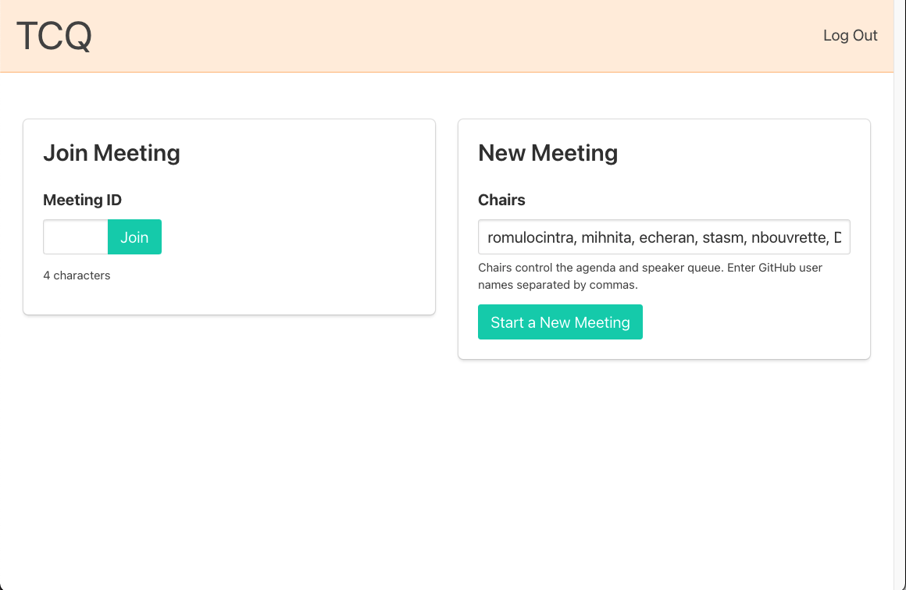

# How to create a new meeting agenda item

### 1. Create a new github issue following the Meeting Agenda template


### 2. Fill with needed information :

```
## Intl.MessageFormat - WG Meeting 

**Time**: 10am PDT (6pm GMT)

**Meeting Notes** :[Link]() *Fill with URL*

**Call** : [Link](https://meet.google.com/nqr-frda-fii)

**TCQ**: [Link]()  *Fill with URL*  [(How to use TCQ)](https://github.com/unicode-org/message-format-wg/blob/master/docs/tcq-howto.md)

## Agenda
- Example Issues
-  Example Issue 2 [#93 ](https://github.com/unicode-org/message-format-wg/issues/93)
```

> Follow this order when filling the meeting agenda items.

**Agenda**

Normally all agenda items points to an github issue 
```
-  Example Issue 2 [#93 ](https://github.com/unicode-org/message-format-wg/issues/93)
```

If there is a need to mention someone please use github handle's for that 

```
-  @romulocintra presenting the example Issue 3 [#93 ](https://github.com/unicode-org/message-format-wg/issues/93)
```

**TCQ**

Follow the [documentation](https://github.com/unicode-org/message-format-wg/blob/master/docs/tcq-howto.md) and use `romulocintra, mihnita, echeran, stasm, nbouvrette, DavidFatDavidF, rxaviers`  as chairs 





**Meeting Notes** 

To generate meeting notes document you should reuse previous meeting notes and modify, the head of document with `TCQ` and new `Agenda` issue links. Please modify the meeting attendees to last meeting attendees and use the shared link to fill the agenda.  

### 3. Sending an notification email

You may reuse the mails already received with subject `Meeting Agenda : YYYY-MM-DD` and send the updated agenda to **message-format-wg@chromium.org** with **message-format-chairs@chromium.org** in cc. 
